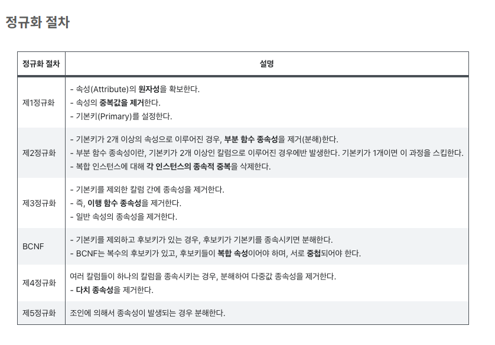
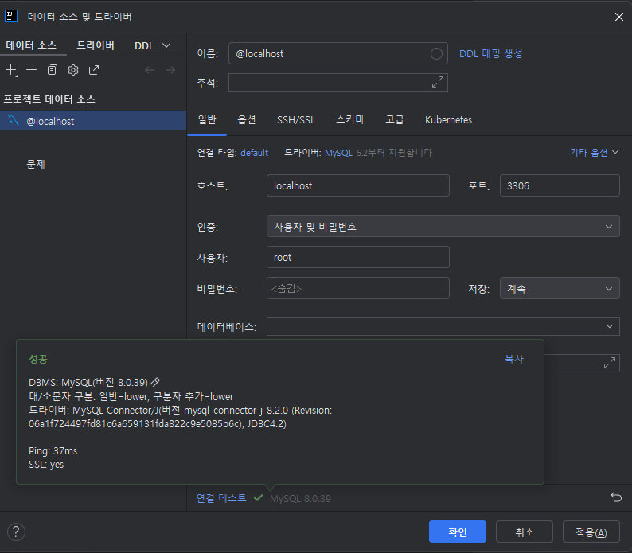
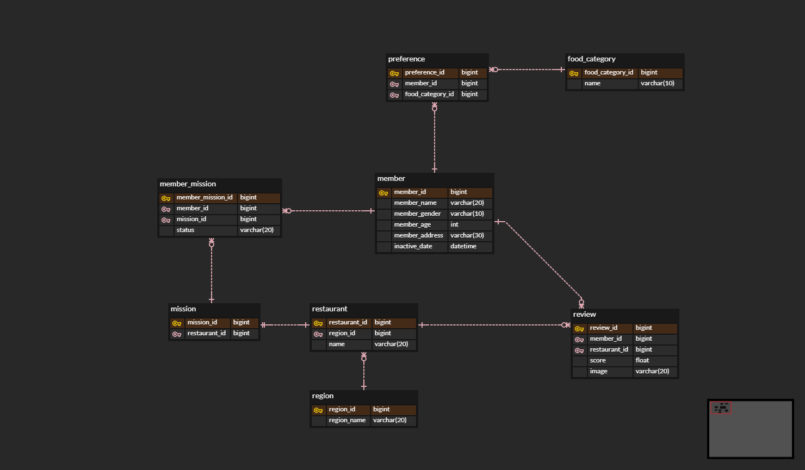

# WEEK 1 - 서현택

##  핵심 키워드

- 외래키 :

        릴레이션 R의 애트리뷰트 집합 FK가 릴레이션 S의 기본 키일때, 이 FK는 R의 외래키이다.

        (FK의 도메인) = (S의 기본 키의 도메인)

        FK의 값은 S에 존재하는 값이거나 null

        R과 S가 같은 릴레이션 일 수도 있음

        R을 참조 릴레이션, S를 피참조 릴레이션이라고 함
- 기본키 : 
  
      유일성과 최소성을 만족하는 후보키 중에서 지정된 하나의 키

      데이터베이스 설계자가 지정

      각 튜플에 대한 기본 키 값은 항상 유효한 값이어야 함(NULL값 허용 안됨)
- ER 다이어그램 : Entity(개체)와 Relationship(관계)를 중점적으로 표시하는 다이어그램
- 복합 키 : 두 개 이상의 컬럼을 묶어서 하나의 기본키로 지정하는 것
- 연관관계 : 관계형 데이터베이스는 테이블끼리 관계를 맺을 수 있다

    1. 1: 1관계 - 하나의 테이블이 상대 테이블과 반드시 단 하나의 관계를 가지는 것
    2. 1:N 관계 - 하나의 테이블의 레코드가 관계를 맺은 테이블의 여러 레코드와 연결된다는 것
    3. M:N  관계- 양족 엔티티 모두에서 1: N(혹은 1:M) 관계를 가지는 것

       이 경우에는 두 테이블의 대표키를 컬럼으로 갖는 연결 테이블을 생성해서 관리
- 정규화 : 정규화는 데이터의 일관성, 최소한의 데이터 중복, 최소한의 데이터 유연성을 위한 방법이며 데이터를 분해하는 과정이다 
정규화를 하면 불필요한 데이터를 입력하지 않아도 되기 때문에 중복 데이터가 제거된다

- 반 정규화 : 데이터 중복을 허용하고, 조인을 줄이는 데이터베이스 성능 향상 방법이다.
반정규화는 select 속도를 향상시키지만, 데이터 모델의 유연성은 낮아진다.

 

## 실습 인증

## 미션

