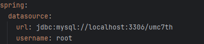

# WEEK 4 - 서현택

## 핵심키워드

- DI :

DI는 Dependency Injection의 준말로 ‘의존성 주입’이라는 뜻을 가진다. 소프트웨어 공학에서 말하는 의존성 주입은 하나의 객체에 다른 객체의 의존성을 제공하는 기술이라고 표현한다. 객체 지향 프로그래밍에서 객체 간의 의존 관계를 외부에서 주입해 주는 디자인 패턴이자 원칙이다. DI는 객체가 가진이 필요한 의존성을 직접 생성하지 않고 외부에서 전달받아 사용하는 방식이다. 이 접근은 코드의 결합도를 낮추고 유연성과 테스트 가능성을 높이는 데 큰 도움이 된다.

- IoC :

Inversion of Control의 약자로 프로그램의 제어 흐름을 개발자가 아닌 프레임워크나 외부 컨테이너가 관리하도록 하는 설계 원칙을 뜻한다. IoC를 적용하면 제어권한이 프레임워크나 컨테이너로 역전되어 객체의 생성과 의존성 주입을 프레임 워크가 책임지게 된다. 개발자는 프레임워크가 제공하는 규칙을 따르며, 프레임워크는 필요한 상황에 맞추어 개발자가 정의한 로직을 호출하는 방식이다.

- 프레임워크와 API 차이 :

프레임워크와 API는 모두 개발자가 코드를 작성할 때 도움을 주는 도구이지만, 그 목적과 사용방식이 다르다. 프레임워크는 애플리케이션 개발의 기본 구조와 흐름을 제공하는 일종의 뼈대이다. 프레임워크는 특정 방식으로 코드가 작동하도록 개발자가 작성하는 코드의 흐름을 제어한다. API는 특정 기능이나 데이터를 제공하는 함수, 클래스, 프로토콜 등을 정의한 일련의 인터페이스이다. API를 통해 소프트웨어 간에 데이터나 기능을 요청하고 제공받을 수 있다.

- AOP : 

Aspect-Oriented Programming의 약자로 관점 지향 프로그래밍이라고 한다. AOP는 비즈니스 로직과 관련이 없는 반복적인 횡단 관심사를 분리하여 코드의 모듈성을 높이는 프로그래밍 기법이다. 

- 서블릿 :

서블릿은 자바를 기반으로 한 웹 애플리케이션을 개발할 때 서버에서 실행되는 프로그램이다. 서블릿은 웹 서버와 클라이언트 사이에서 요청을 처리하고 응답을 생성하여 전달하는 역할을 한다. 

# 실습 - Database와 Spring 프로젝트 연결

