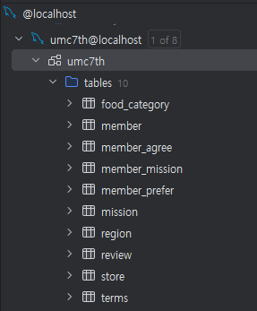

# WEEK5 - 서현택

## 핵심키워드

- Domain :
도메인 모델은 소프트웨어 개발에서 애플리케이션의 비즈니스 로직을 표현하는 중요한 개념이다. 주로 애플리케이션의 핵심적인 문제 도메인과 관련된 객체들, 그들의 관계, 그리고 행동을 정의한 구조이다.

- 양방향 매핑 :
양방향 매핑은 데이터베이스나 객체 지향 프로그래밍에서 두개의 엔티티 간 관계를 서로 참조할 수 있도록 설정하는 것을 뜻한다. 즉, 한 엔티티에서 다른 엔티티를 참조할 수 있고, 반대로 그 엔티티에서도 처음의 엔티티를 참조할 수 있다. 양방향 매핑을 통해 각 엔티티는 상대방의 정보를 쉽게 접근할 수 있다.

- N + 1문제 :
  연관 관계로 매핑된 엔티티를 조회할 때 의도치 않게 첫번째 쿼리로 날린 결과만큼 n번의 쿼리가 더 나가는 것을 뜻한다. join fetch를 통해 해결할 수 있다.

## 미션

https://github.com/agliotomato/umc-spring/tree/mission5